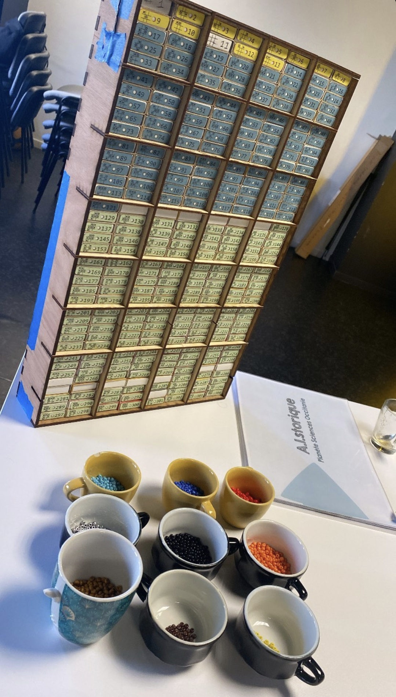
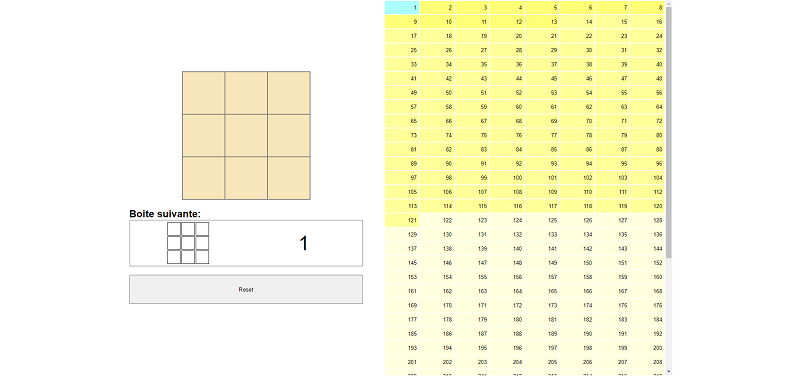

# ❌ MENACE️ ⭕

<<<<<<< HEAD
[MENACE](https://en.wikipedia.org/wiki/Matchbox_Educable_Noughts_and_Crosses_Engine) is a tic-tac-toe *mechanical* artificial intelligence invented by Donald Michie in 1960 that use reinforcement learning in the form of beads of colors and matchboxes.  

This repository compile my implementation with the code to obtain the 304 states for every matchbox, all the files to recreate the box and the web interface to help finding the correct box.

TODO end product photo

=======
[MENACE](https://en.wikipedia.org/wiki/Matchbox_Educable_Noughts_and_Crosses_Engine) (Matchbox Educable Noughts and Crosses Engine) is a tic-tac-toe *mechanical* artificial intelligence invented by Donald Michie in 1960 that use reinforcement learning in the form of beads of colors and matchboxes.  

This repository compile my implementation, you will find:
- the code to obtain the 304 states for every matchbox
- all the files to recreate the box
- the web interface to help finding the correct box

 

>>>>>>> 6edb56544529a7b294fa7536a4c2fb47098f25cf
## Video presentation
TODO

## How it works
The human player chooses the beads at random, just like a neural network’s weights are random at the start. Also like weights, the beads are adjusted when there is failure or success.

When a game is over:
- If MENACE loses: **each bead MENACE used is removed from each box**
<<<<<<< HEAD
- If MENACE wins: **three beads are added to eacah box of the used color**
- If the game is a draw: **one bead is added**

After around 200 games, each matchboxes will have more beads than others and  
=======
- If MENACE wins: **three beads are added to each box of the used color**
- If the game is a draw: **one bead is added**

After around 200 games, each matchboxes will have more beads than others and MENACE should be fully trained (i.e it will be unable to loose)
>>>>>>> 6edb56544529a7b294fa7536a4c2fb47098f25cf

## Building materials

- 5mm planks for outer structure
- 3mm planks for inner structure
- 304x matchboxes of dimension 36,5 x 53 x 11,6 mm
- ??x colored beads
- 4x hinges
- Paper for priting the box labels

<<<<<<< HEAD
## Dimensions

The main box is (311 x 472 x 46) mm, it contains vertical and horizontals planks to provide structure and hold the 304 mathboxes in place. There is two boxes between each vertical plank and five between each horizontal one. The whole structure is held together using box joints.
=======
The boxes can be divided in four categories, one for every turn menace plays:
Move count 3: 183 boards
Move count 2: 108 boards
Move count 0: 1 boards
Move count 1: 12 boards

## Dimensions

The main box is (311 x 472 x 65) mm, it contains vertical and horizontals planks to provide structure and hold the 304 mathboxes in place. There is two boxes between each vertical plank and five between each horizontal one. The whole structure is held together using box joints.
>>>>>>> 6edb56544529a7b294fa7536a4c2fb47098f25cf

We also laser cut a tic tac toe board and pieces to let the participants play the game physically.

**Here are the details for each part**

### Box (5mm planks)
1x backpane: (311 x 472) mm 
 
<<<<<<< HEAD
    width:  
=======
    exterior width:  
>>>>>>> 6edb56544529a7b294fa7536a4c2fb47098f25cf
        36.5mm * 8 // mathbox width  
        + 3mm * 3 // vertical inner planks  
        + 5mm * 2 // exterior planks  
        = 311mm  

<<<<<<< HEAD
    height:  
=======
    exterior height:  
>>>>>>> 6edb56544529a7b294fa7536a4c2fb47098f25cf
        11.6mm * 38 // mathbox height  
        + 3mm * 7 // horizontal inner planks  
        + 5mm * 2 // exterior planks  
        = 471.8mm  

2x doors: (155,5 x 471.8) mm

2x top/bottom pane: 311 x 46 mm

### Inner structure (3mm planks)

<<<<<<< HEAD
3x vertical planks: 301mm x 3mm
7x horizontal plans: 461.8mm x 3mm
=======
3x vertical planks: 301mm x 65mm  
7x horizontal plans: 461.8mm x 65mm
>>>>>>> 6edb56544529a7b294fa7536a4c2fb47098f25cf

## Web interface

I've built a web interface that you can use to know which box to use for a given state.  
<<<<<<< HEAD
To use it, simply open the file `interface/index.html` in your browser.

TODO screenshot of webui
=======
To use it, simply open the file `interface/index.html` in your browser or go to rubengr.es/menace

>>>>>>> 6edb56544529a7b294fa7536a4c2fb47098f25cf

# Training stats

By looking at the changes in the first box, you can have an idea of how menace performs.
This is analog to the loss in a machine learning game.

TODO once it's trained
